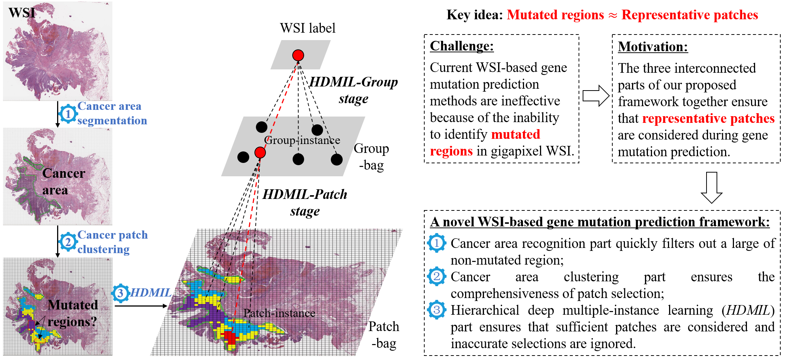

## HDMIL: Hierarchical Deep Multiple Instance Learning

 

- - -
### Dataset
* Training and internal validation: The WSIs used in training and internal validation are from TCGA (https://portal.gdc.cancer.gov/), open access to all. 
* External validation: we have collected a total of 81 (FGFR3 mutation: 10, FGFR3 wild type: 71) bladder cancer patients' data (WSI + mutation status of the FGFR3) from Fudan University Shanghai Cancer Center (FUSCC). Based on this dataset (16 mutation WSI, 103 wildtype WSI), we conduct external validation (train on TCGA, test on FUSCC).

  The Google Disk download link of the FUSCC dataset (118GB) is: https://drive.google.com/drive/folders/14W1LQx7730gjpXwjDJhbP6YM8_gL50QV?usp=sharing

  The Baidu Netdisk download link of the FUSCC dataset (118GB) is: https://pan.baidu.com/s/1qunRbsejQ1x8YDtS-eyTxQ?pwd=4y50
- - -
### cancer_area_segmentation: Identify cancer area for each WSI

* `camelyon16xml2json.py`: Convert contour annotation from xml format to json format.
* `tissue_mask_svs.py`: Get the tissue area of WSI.
* `tumor_mask.py`: Get the cancer area mask of WSI.
* `non_tumor_mask.py`: Get the normal area mask of WSI.
* `genPatch_multi.py`: Generate patch dataset according to the tissue area file and annotation file.That is, the dataset for training the cancerous area segmentation model.
* `train_fuzhong_c2.py`：Train cancerous area segmentation model on cancer and normal patch dataset.
* `probs_map_svs_window_slide.py`：Predicting the cancerous area heatmap of WSI using cancerous area segmentation model.

### get_byol_features: Use BYOL for patch embedding

* `train.py`：Training the BYOL model on our pathological iamge (patch) dataset.
* `probs_map_svs_window_slide_feature.py`：Use the trained BYOL for patch embedding.

### cancer_patch_clustering: Clustering patches in cancer area

* `featureClustering.py`：Clustering with the features extracted from BYOL.
* `randomSelect.py`：According to the cancerous patch clustering results, randomly select patches to build HDMIL training set.

### hierarchical_dmil：HDMIL training

* `getPatchbyCoordsMIL.py`：Generate training dataset for HDMIL-Patch.

* `make_data_list_mil.py`：Make and split training set, validation set and test set for HDMIL model.

* `mil1_train.py`：Training the HDMIL-Patch model.

* `test_features_random.py`：Extract and generate features using the trained HDMIL-Patch model.

* `mil2_train.py`：Training the HDMIL-Group model.

### Interpretability: Obtaining the Top_k patches

* `mil1_train_attention_weight_sort.py`: Extracting top_k1 attention weights and their corresponding patches using the trained HDMIL-Patch model.

* `mil2_train_attention_weight_sort.py`: Extracting top_k2 attention weights and their corresponding patches using the trained HDMIL-Group model.

- - - 
### Environments
* Python==3.8.3
* Ubuntu==18.04.5
* torch==1.7.0
* torchvision==0.8.1
* timm==0.3.2
* imageio==2.25.1
* matplotlib==3.6.2
* numpy==1.23.0
* opencv-python==4.6.0.66
* pandas==1.5.2
* Pillow==9.4.0
* scikit_image==0.17.2
* scikit_learn==1.2.1
* scipy==1.10.1
* skimage==0.0
* spams==2.6.5.4
* tensorboardX==2.6
* pytorch_lightning==1.9.3
* openslide_python==1.1.2
- - -
If you have any questions, please contact Rui Yan at yanrui666666@gmail.com.

